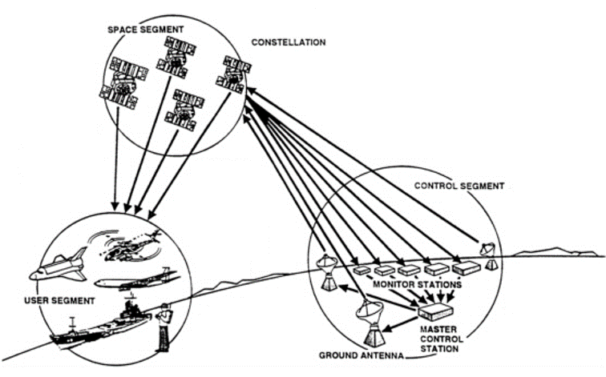
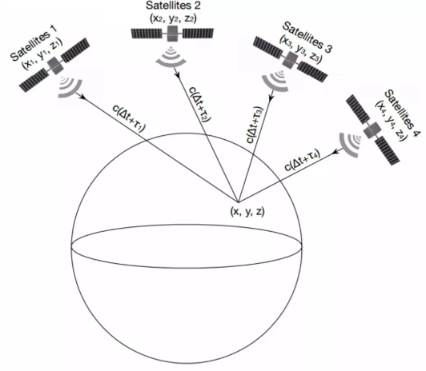

# GPS Tutorial: Scheme and spoofing

Jianqiu Cao

## GPS Introduction

GPS consists of three segments - the satellite segment (**satellite constellation**), the ground segment (**ground control network**), and the user segment (**user equipment**). See Figure 1 below.

Figure 1. GPS segment

The **satellite constellation** comprises satellites in low earth orbit that provide the ranging signals and navigation data messages to user equipment. 

The **ground control network** tracks and maintains the satellite constellation by monitoring satellite health and signal integrity and maintaining the satellite orbital configuration. Furthermore, the ground control network also updates the *satellite clock corrections* and *ephemerides* as well as numerous other parameters essential to determining user position,velocity, and time (*PVT*). 

The **user equipment** receives signals from the satellite constellation and computes user *PVT*. [^3]

## Positioning Principles: Triangulating

The GPS positioning principles can be shown in Figure 2 below. [^1]

Figure 2. GPS Positioning Principle

Suppose we have three satellites (Satellite 1, 2 and 3) in the constellation broadcasting their coordinates (x1, y1, z1), (x2, y2, z2), (x3, y3, z3) with timestamps, and we have also measured the durations (τ1, τ2, τ3) between the broadcasting signals are sent and received by a user equipment, we can then "*triangulate*" the user's coordinates (x, y, z) by the following equations: 

, where c is the velocity of electromagnet wave, and  are the range from the satellites to the receiver.

However, the problem is more complex in engineering practice. The satellites have precise atomic clock
on board, but the receiver doesn’t, which means the local (receiver's) clock and satellite clock are not
synchronized, so the measured durations τ1, τ2, τ3 are not precisely the true transmission durations, rather, the true transmission durations should be , where  is the time difference between the local clock and the satellite clock. The revised equations are as below:

We call  "*pseudorange*".

As the satellite clocks are well synchronized, we can assume that  . If we can receive the data from a 4th satellite, we can then add the 4th equation to the equation set, which becomes: 

So we can solve out the four knowns x, y, z and Δt from the four equations. Note that not only the receiver's position (x, y, z) can be solved, but also the local clock can be synchronized to the GPS time in this procedure.

## GPS Signals

Editing...

## Attacks

**GPS Simulator Attacks**[^1]

* Use *ephemeris* data (BRDC file) archive and spoofing location to generate GPS baseband signal data streams. The opensource software GPS-SDR-SIM is available for this use.[^5]

* Transmit the signal using SDR (Software Defined Radio) platforms.

  ​

**C/A Code Spoofing Attack**[^2][^4]

* Does not change the navigation message, but only tampers with the *pseudorange* between the satellite and receiver. 
* The spoofer estimates the position and velocity of the victim and then transmits an artificial seamless signal that conveys spoofing C/A code.
* Can be used for spoofing Military GPS under certain restrictions.[^4]

## Reference list

[^1]: Wang, K., Chen, S., Pan, A., [Time and Position Spoofing with Open Source Projects](https://docs.google.com/a/hawaii.edu/viewer?a=v&pid=sites&srcid=aGF3YWlpLmVkdXx1aC11YXMtcHJvamVjdHN8Z3g6MjcxM2JkMjllYzA1NzM2). 

[^2]: Shin, B., etc., [Spoofing Attack Results Determination in Code Domain Using a Spoofing Process Equation](https://docs.google.com/a/hawaii.edu/viewer?a=v&pid=sites&srcid=aGF3YWlpLmVkdXx1aC11YXMtcHJvamVjdHN8Z3g6N2FjNzY5MzhmZDgxOWU3). 

[^3]: FAA, [GNSS Frequently Asked Questions - GPS](https://www.faa.gov/about/office_org/headquarters_offices/ato/service_units/techops/navservices/gnss/faq/gps/#1). 

[^4]: Tippenhauer, N., etc., [On the Requirements for Successful GPS Spoofing Attacks](https://docs.google.com/a/hawaii.edu/viewer?a=v&pid=sites&srcid=aGF3YWlpLmVkdXx1aC11YXMtcHJvamVjdHN8Z3g6N2QwNGMzOGYzNzdiNjhiOA).

[^5]: Takuji Ebinuma, [GPS-SDR-SIM](https://github.com/osqzss/gps-sdr-sim).